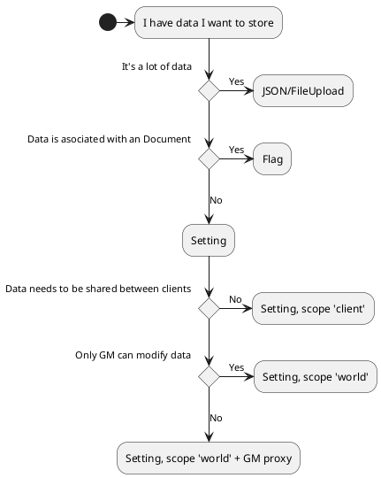

> Page is known to be up to date with Core Version 10
{.is-info}

This article is primarily geared towards Module development, but Systems can make use of its contents as well. It largely ignores the options for data storage that Systems have that come with being able to control Document types via the `system` property of some document types.

## Data Storage Flowchart



Use case flowchart:
1. I want to store a _lot_ of data and don't want it to affect performance -> **FileUpload with JSON**. Note that permissions might be set up on the world such that only the GM can upload files.
2. I want to store data associated with a particular document -> **Flag**. Some documents are not editable by all clients and flags respect that.
3. I want to store data not associated with a particular document:
	  1. The data does not have to be shared between clients -> **Setting, scope `client`**.
 	  2. The data does have to shared between clients:
		    1. All clients need to access and modify -> **Setting with a GM Proxy** is the only way to do this, it is not pretty.
		    2. All clients need access but only the GM should be able to modify -> **Setting, scope `world`**, no workarounds needed.


## Flags

*Main API Documentation Article: [Flags](https://foundryvtt.wiki/en/development/api/flags)*

Flags are the safest way for modules to store arbitrary data on existing documents. If you are developing a module which allows the user to store some data on a document that isn't supported normally in Foundry Core or a system's data structure, you should use a flag.

Flag data can be of any type, as long as it can be `JSON.stringify`ed.

> Flags can not just be used with Actors, Items, and things Systems normally interact with, but with almost all types of documents (`Setting`s being the only exception). And in Foundry, many things are documents, see the official API documentation for more information about the available types ([Primary Document Types](https://foundryvtt.com/api/#primary-document-types), [Embedded Document Types](https://foundryvtt.com/api/#embedded-document-types)).

### Setting a flag's value
Flags are automatically namespaced within the first parameter given to [`Document#setFlag`](https://foundryvtt.com/api/classes/foundry.abstract.Document.html#setFlag). It must be the `id` of the module the flag belongs to.

```js
const newFlagValue = 'foo';

await someDocument.setFlag('myModuleId', 'myFlagName', newFlagValue);
```

#### Can I mutate the value directly?
Setting a flag's value without `setFlag` will not persist that change in the database, so this should usually be avoided. There are niche use cases where it may make sense, for example as part of a larger operation which persists a documents's data in the database—such as character sheet editing—but the genral recommendation is not to do it.

### Getting a flag's value
There are two places to get a flag value: On the data model itself, or with the `getFlag` method.

#### getFlag
[`Document#getFlag`](https://foundryvtt.com/api/classes/foundry.abstract.Document.html#getFlag)

```js
const flagValue = someDocument.getFlag('myModuleName', 'myFlagName');
// flagValue === 'foo'
```

> Beware that if you attempt to get a flag for a module which is not installed/activated, `getFlag` will `throw` an error. If you need a flag from a module which might not be active, it is safer to look for the data on the date model itself, or you need to handle it with `try/catch`.
{.is-danger}

#### via the data model itself
Documents that support flags have a `flags` property. It is an object where the keys are namespaces (for modules, that's the module `id`), and the values are again objects, where the keys are the flag names, as set via `setFlag`.

### Unset a flag
A safe way to delete your flag's value is with [`Document#unsetFlag`](https://foundryvtt.com/api/classes/foundry.abstract.Document.html#unsetFlag). This will fully delete that key from your module's flags on the provided document.

```js
await someDocument.unsetFlag('myModuleId', 'myFlagName');
```

### How do I use this?
It's arbitrary data that you can safely control on (almost) any `Document`. Because of this, all of the hooks related to that document are going to have your flag available when they fire.

For example, if you have a flag on a Scene, you can check if that flag exists when the `updateScene` hook fires.

```js
Hooks.on('updateScene', (scene, data) => {
  if (hasProperty(data, 'flags.myModule')) {
    console.log(data);
  }
});
```

### Some Details about `setFlag` and objects

When the thing being set is an object, the API doesn't replace the object with the value provided in the setFlag call, instead it merges the update in.

When you look at the code, this makes sense. `Document#setFlag` is a very thin wrapper around `Document#update`, but it isn't necessarily what you would expect.

Example to demonstrate:
```js
game.user.setFlag('world', 'todos', { foo: 'bar', zip: 'zap' });
// flag value: { foo: 'bar', zip: 'zap' }

game.user.setFlag('world', 'todos', {});
// flag value: { foo: 'bar', zip: 'zap' }
// no change because update was empty

game.user.setFlag('world', 'todos', { zip: 'zop' });
// flag value: { foo: 'bar', zip: 'zop' }
```

`Document#setFlag` should perhaps be thought about as "updateFlag" instead, but that's only partly true because it can also set flags which doesn't exist yet.

The biggest use case that is impacted by this is stroing an object as a flag, and then wanting to delete keys from it.

The initial instinct of "I'll setFlag with an object that has everything but that thing which was deleted," doesn't work here. Instead you can either jerryrig `unsetFlag` in an unintuitive way:
```js
game.user.unsetFlag('world', 'todos.foo');
// flag value: { zip: 'zop' }
```

OR you can use the foundry-specific `-=key: null` syntax:
```js
game.user.setFlag('world', 'todos', { ['-=foo']: null });
// flag value: { zip: 'zop' }
```

If you're happy with the key being `null`, setting it to `null` explicitly works as you'd expect:
```js
game.user.setFlag('world', 'todos', { foo: null });
// flag value: { foo: null, zip: 'zop' }
```

## Settings

*Main API Documentation Article: [Settings](https://foundryvtt.wiki/en/development/api/settings)*

Settings, like flags, are a way for modules to store and persist data. Settings are not tied to a specific document however, unlike flags. Also unlike flags they are able to leverage the 'scope' field to keep a set of data specific to a user's localStorage (`scope: client`) or put that data in the database (`scope: world`).

For the vast majority of use-cases, settings are intended to be modified by a UI, either a Menu or within the Module Settings panel itself. These settings are intended to be used to modify the functionality of a module or system, rather than store arbitrary data for that module or system.

### Registering a Setting

All settings must be registered before they can be set or accessed. This needs to be done with [`game.settings.register`](https://foundryvtt.com/api/classes/client.ClientSettings.html#register), with `game.settings` being an instance of `ClientSettings`.

```js
/*
 * Create a custom config setting
 */
await game.settings.register('myModuleId', 'mySettingName', {
  name: 'My Setting', // can also be an i18n key
  hint: 'A description of the registered setting and its behavior.', // can also be an i18n key
  scope: 'world',     // "world" = sync to db, "client" = local storage 
  config: true,       // false if you dont want it to show in module config
  type: Number,       // Number, Boolean, String, or even a custom class or DataModel
  default: 0,
  range: {.           // range turns the UI input into a slider input
    min: 0,           // but does not validate the value
    max: 100,
    step: 10
  },
  onChange: value => { // value is the new value of the setting
    console.log(value)
  },
  filePicker: false,	// set true with a String `type` to use a file picker input,
  requiresReload: false, // when changing the setting, prompt the user to reload
});
```

### Setting a Setting's value
Settings can be set with [`game.settings.set`](https://foundryvtt.com/api/classes/client.ClientSettings.html#set). It's important to note that a `scope: world` setting can only be set by a Gamemaster user, and that `scope: client` settings will only persist on the user's local machine.

```js
const whateverValue = 'foo';

await game.settings.set('myModuleId','myModuleSetting', whateverValue);
```

### Getting a Setting's value

Settings can be read with [`game.settings.get`](https://foundryvtt.com/api/classes/client.ClientSettings.html#get). 

```js
const someVariable = game.settings.get('myModuleId','myModuleSetting');
console.log(someVariable); // expected to be 'foo'
```

### Reloading after modifying a setting
Sometimes a setting's value changing means that the foundry client should reload for it to take effect. As of V10, foundry provides a built in way to do this: When the `requiresReload` option is set for the setting, changing it will prompt the user to reload.

This is the recommended way, but if you really don't want to prompt the user but just trigger the reload automatically (or you are working with an earlier Foundry version), you can do it with the `onChange` callback. The reload should be debounced to allow for the case where several changed settings require a reload.

```js
game.settings.register("myModuleId", "myModuleSetting", {
  // ...,
  onChange: foundry.utils.debouncedReload
}

game.settings.register("myModuleId", "myOtherSetting", {
  // ...,
  onChange: foundry.utils.debouncedReload
}
```
`debouncedReload` has only been introduced in V10, so if you want to do it in earlier versions, you need to write it yourself:
```js
const debouncedReload = foundry.utils.debounce(window.location.reload, 100);
```

### Setting Menus

Sometimes, your use case is more complex than a few settings will allow you to manage. In these cases the best way is to register a settings menu with [`game.settings.registerMenu`](https://foundryvtt.com/api/classes/client.ClientSettings.html#registerMenu), and manage your settings logic with a [FormApplication](https://foundryvtt.wiki/en/development/guides/understanding-form-applications). Note that we aren't actually registering a setting to be stored, but simply a menu button.

This works best when used in conjunction with a registered setting of type `Object`.

```js
game.settings.registerMenu("myModuleId", "mySettingsMenu", {
  name: "My Settings Submenu",
  label: "Settings Menu Label",      // The text label used in the button
  hint: "A description of what will occur in the submenu dialog.",
  icon: "fas fa-bars",               // A Font Awesome icon used in the submenu button
  type: MySubmenuApplicationClass,   // A FormApplication subclass
  restricted: true                   // Restrict this submenu to gamemaster only?
});


await game.settings.register('myModuleId', 'myComplexSettingName', {
  scope: 'world',     // "world" = sync to db, "client" = local storage 
  config: false,      // we will use the menu above to edit this setting
  type: Object,
  default: {},        // can be used to set up the default structure
});


/**
 * For more information about FormApplications, see:
 * https://foundryvtt.wiki/en/development/guides/understanding-form-applications
 */
class MySubmenuApplicationClass extends FormApplication {
  // lots of other things...
  
  getData() {
  	return game.settings.get('myModuleId', 'myComplexSettingName');
  }
  
  _updateObject(event, formData) {
    const data = expandObject(formData);
    game.settings.set('myModuleId', 'myComplexSettingName', data);
  }
}
```

#### Why would I want this?

FormApplications allow you to run any logic you want, which includes setting settings, thus this kind of power could be leveraged to accomplish many things:

1. **Space.** You could easily use this to tidy up a lot of module settings which would otherwise take up a lot of vertical space on the settings list.
2. **Validation.** Since you control the FormApplication's submit logic, you could run validation on user inputs before saving them to the database.
3. **Edit Setting Objects.** If you have a use case for a complex object of data being stored as a setting, a FormApplication menu would let your users manipulate that object directly.


## JSON and FileUpload

A third option exists for modules and systems which deal with large amounts of very bulky data that is prefered so as not to clutter up the settings database with vast amounts of 'useless' data if the module is ever removed.

> Stub. Example can be found here: https://github.com/flamewave000/dragonflagon-fvtt/blob/master/df-chat-enhance/src/archive/DFChatArchive.ts
